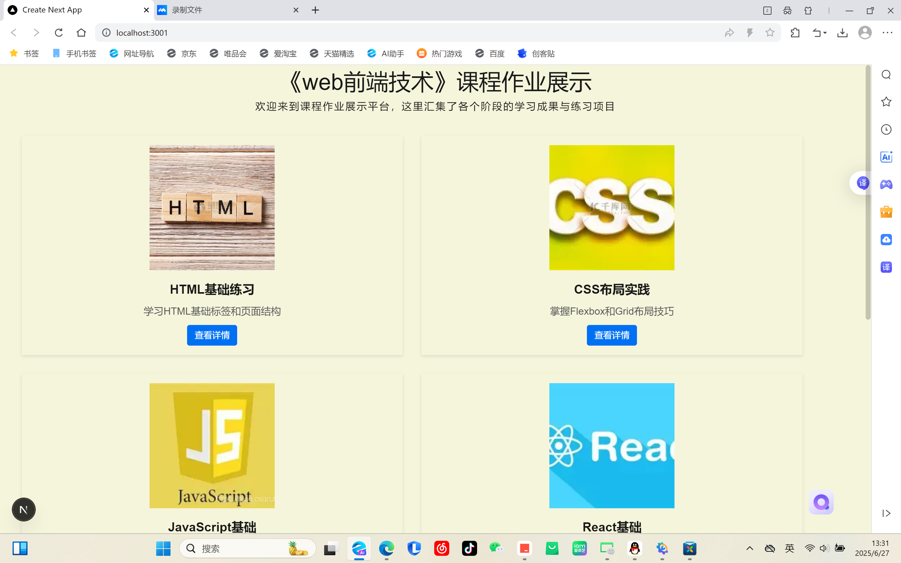
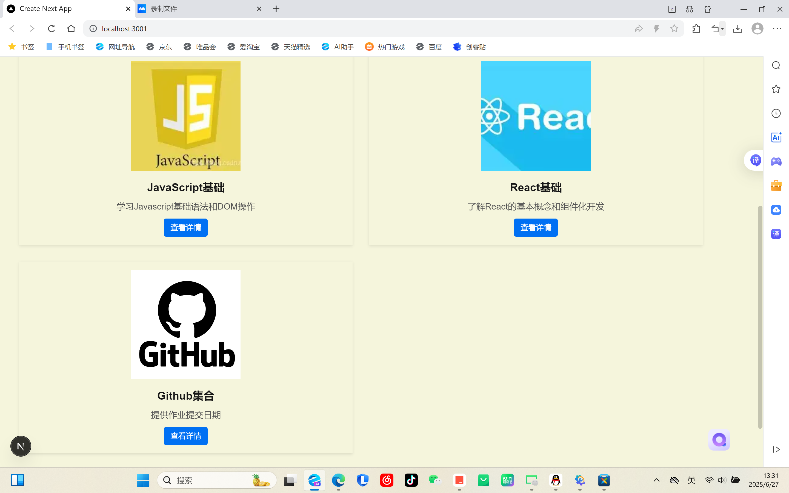
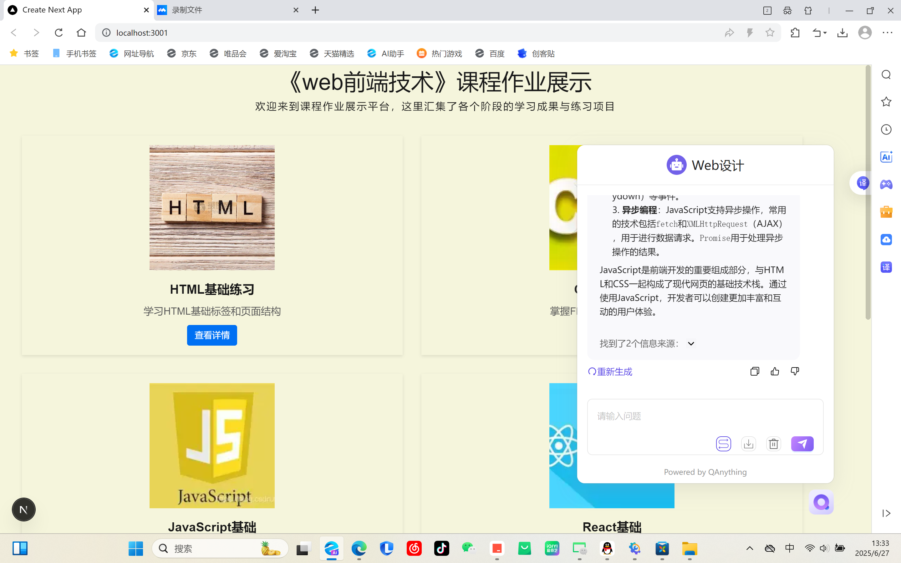
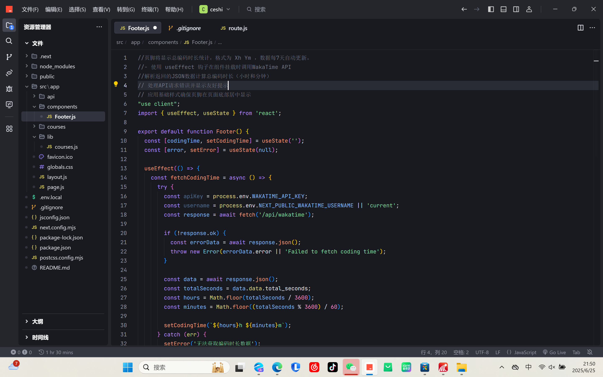
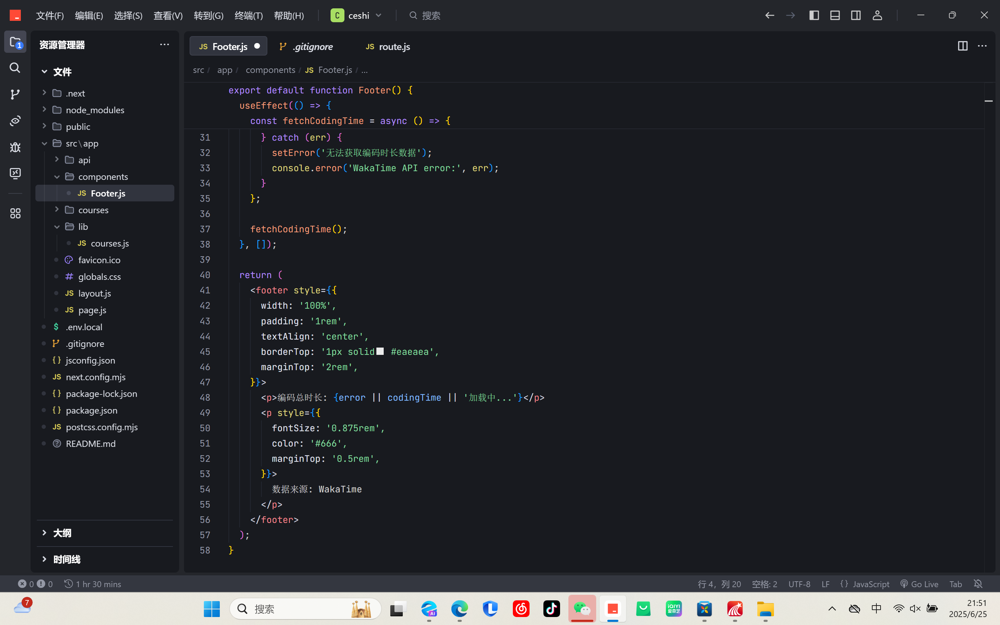

This is a [Next.js](https://nextjs.org) project bootstrapped with [`create-next-app`](https://github.com/vercel/next.js/tree/canary/packages/create-next-app).

## Getting Started

First, run the development server:

```bash
npm run dev
# or
yarn dev
# or
pnpm dev
# or
bun dev
```

Open [http://localhost:3000](http://localhost:3000) with your browser to see the result.

You can start editing the page by modifying `app/page.js`. The page auto-updates as you edit the file.

This project uses [`next/font`](https://nextjs.org/docs/app/building-your-application/optimizing/fonts) to automatically optimize and load [Geist](https://vercel.com/font), a new font family for Vercel.

## Learn More

To learn more about Next.js, take a look at the following resources:

- [Next.js Documentation](https://nextjs.org/docs) - learn about Next.js features and API.
- [Learn Next.js](https://nextjs.org/learn) - an interactive Next.js tutorial.

You can check out [the Next.js GitHub repository](https://github.com/vercel/next.js) - your feedback and contributions are welcome!

## Deploy on Vercel

The easiest way to deploy your Next.js app is to use the [Vercel Platform](https://vercel.com/new?utm_medium=default-template&filter=next.js&utm_source=create-next-app&utm_campaign=create-next-app-readme) from the creators of Next.js.

Check out our [Next.js deployment documentation](https://nextjs.org/docs/app/building-your-application/deploying) for more details.

## 运行截图

  
 
 
 
 
 

## 项目简介

本项目是一个基于Next.js的课程作业展示平台，它使用了QAnything和Wakatime API来实现课程作业的展示和时间统计功能。

## QAnything集成路径与实现细节

本项目中，QAnything的集成路径为：`src/app/page.js`。具体实现细节如下：

1. 在`src/app/page.js`中，引入了QAnything的脚本文件。

2. 在`src/app/page.js`中，使用了QAnything的API来实现课程作业的展示。具体来说，使用了`QAnything.embedChatbot`方法来嵌入QAnything的聊天机器人。该方法的参数如下：
   - `container`：聊天机器人的容器元素，即QAnything的聊天机器人会嵌入到该元素中。
   - `botId`：聊天机器人的ID，即QAnything的聊天机器人的唯一标识符。
   - `config`：聊天机器人的配置对象，其中包含了聊天机器人的一些配置信息，如聊天机器人的名称、头像、背景颜色等。

## Wakatime API集成路径与实现细节

本项目中，Wakatime API的集成路径为：`src/app/page.js`。具体实现细节如下：
1. 在`src/app/page.js`中，引入了Wakatime API的脚本文件。
2. 首先将key和name保存在环境变量里面，调用wakatime api server（直接用Wakatime的现成代码）